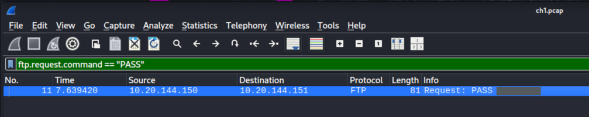

# FTP Authentication - [Challenge Link](https://www.root-me.org/en/Challenges/Network/FTP-authentication)

## 🧠 Summary
This challenge demonstrates how FTP transmits credentials in cleartext and how a passive network capture can reveal usernames and passwords.

**Theory (security):**
- FTP sends authentication (USER/PASS) and file data in plaintext unless protected by TLS/SSL (FTPS) or replaced by SFTP. An attacker on the same network or on a path between client and server can capture Ethernet/802.11 frames and extract the PASS command directly from the traffic.
- The FTP protocol has two modes: active and passive. Both can expose credentials during the control channel exchange. Mitigations include using FTPS or SFTP, enforcing strong unique passwords, network segmentation, and using VPNs for untrusted networks.

## 🧰 Tools Used
- `Wireshark` (or `tshark`/`tcpdump`) to inspect the capture
- `wget` / curl to download challenge files

## 💣 Exploitation / Solution
Step-by-step:

1. Download the `.pcap` provided by the challenge (example):
```bash
wget "<pcap_url>"
```

2. Open the capture in Wireshark:
```bash
wireshark ch1.pcap &
```

3. Filter for FTP password commands in Wireshark using the display filter:
```text
ftp.request.command == "PASS"
```
This will show frames where the client sends the `PASS` command; the packet detail contains the password in cleartext (e.g. `Response: PASS <password>`).



Conclusion: capturing the pcap and filtering for `PASS` quickly reveals the credentials — illustrating why plain FTP is insecure on untrusted networks.

## 🏁 Flag / Result
flag hash:
`c736bbba5daea7ffba425a7a57a1c60e6314d5967b03a59e71bc200b5bb9ecd9`

## ✏️ Notes
- What was new or tricky? Nothing special — the password was in plaintext in the capture.
- Alternate paths: if credentials were not in cleartext, one might attempt credential reuse, credential spraying, or exploiting weak TLS configurations.
- [Useful link to FreeKB](https://www.freekb.net/Article?id=133)