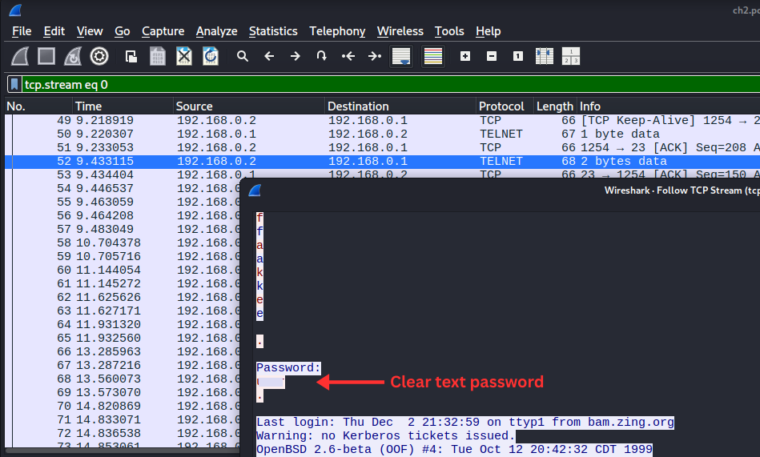

# Telnet Authentication - [Challenge Link](https://www.root-me.org/en/Challenges/Network/TELNET-authentication)

## 🧠 Summary
This challenge demonstrates how Telnet transmits credentials and session data in cleartext, allowing attackers to extract sensitive information from network captures.

**Theory (security):**
- Telnet is an unencrypted remote login protocol that sends all data—usernames, passwords, and commands—in plaintext over the network. Any attacker with network access (same subnet, ISP path, via ARP spoofing, etc.) can capture the traffic and extract credentials instantly.
- Unlike SSH (Secure Shell), Telnet has no encryption, authentication, or integrity protection. A Wireshark capture of Telnet traffic can be reconstructed into a readable stream by following the TCP connection, exposing the entire interactive session.
- Telnet operates on port 23 and runs plaintext commands directly over TCP. Mitigations include replacing Telnet with SSH, enforcing TLS/SSL wrappers if Telnet must be used, restricting Telnet to trusted networks only, using VPNs for remote administration, implementing network-level access controls, and disabling Telnet services when not required.

## 🧰 Tools Used
- `Wireshark` (or `tshark`/`tcpdump`) to inspect the capture
- `wget` / curl to download challenge files

## 💣 Exploitation / Solution
Step-by-step:

1. Download the `.pcap` provided by the challenge (example):
```bash
wget "<pcap_url>"
```

2. Open the capture in Wireshark:
```bash
wireshark ch2.pcap &
```

3. Locate a Telnet packet in the capture (port 23, or filter for `telnet` protocol).

4. Right-click on a Telnet frame and select **Follow** → **TCP Stream**:
   - A new window will open showing the entire TCP stream in readable text
   - The username, password, and all session commands will be visible in plaintext



Conclusion: following the TCP stream instantly reveals credentials — demonstrating why Telnet is critically insecure and should never be used for sensitive communications.


## 🏁 Flag / Result
flag hash:
`04f8996da763b7a969b1028ee3007569eaf3a635486ddab211d512c85b9df8fb`

## ✏️ Notes
- What was new or tricky? Nothing special — the entire session including password was readable in the TCP stream.
- Alternate paths: if Telnet credentials were somehow obfuscated (unlikely), one might examine the raw packet hex or attempt credential reuse attacks.
- [Usefull link to Nov4ou's Blog](https://nov4ou.github.io/posts/a-step-by-step-guide-to-telnet-packet-capture-and-password-retrieval/)