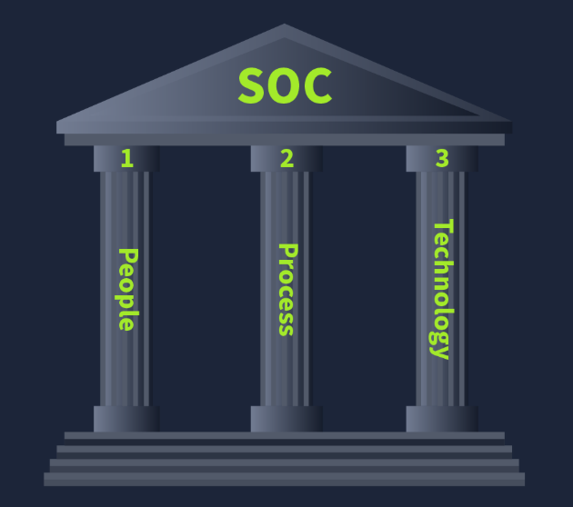
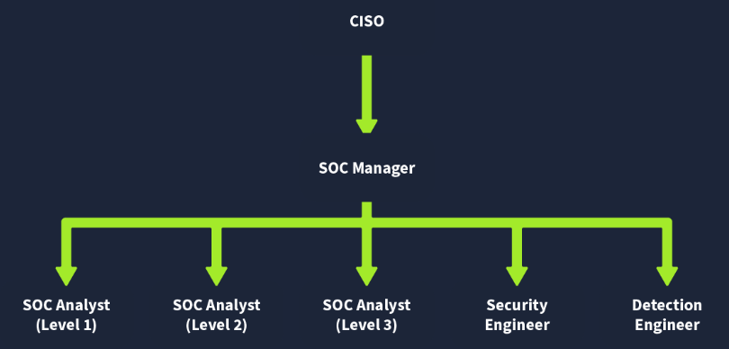

# SOC-Fundamentals

## What this is
The main focus of the SOC (Security Operations Center) team is to keep Detection and Response intact. The SOC team has some ressources available (SIEM's) in the form of security solutions that help them achieve this.

### Detection
- `Detect Vulnerabilities` : A vulnerability is a weakness that an attacker can exploit.
- `Detect Unauthorized Activity` : Consider the case where the attacker discovered the username and password of someone (ex: employe). It is crucial to detect this kind of unauthorized acitivity as fast as possible to avoid the attacker doing any damage.
- `Detect Policy Violations` : A security policy is a set of rules and procedures created to help protect a company against attacks. Each company has its own Policies and Procedures (ex: Downloading pirated media files and sending confidential company data).
- `Detect Intrusions` : Instrusions refet to unauthorized access to systems and networks. One scenario would be an attacker successfully exploiting a web application.

### Response
- `Support with Incident Response` : Once an incident is detected, certain steps are taken to respond to it. This response includes minimizing its impact and performing the root cause analysis of the incident.

## SOC Pillars
There are 3 pillars of a SOC. With all these pillars, a SOC team becomes mature and efficiently detects and responds to different incidents. These pillars are `People`, `Process`, and `Technology`.

### People 
The people are known as the SOC team. This team has the following roles and responsibilities :

### Process
Alert Triage : The alert triage is the basis of the SOC team. The first repsonse to any alert is to perform the triage. The triage is focused on analyzing the specific alert. This determines the severity of the alert and helps us prioritize it. The alert triage is all about answering the 5 Ws : 

Lets check the following example : `Alert : Malware detected on Host: GEORGE PC`
- `What ?` : A malicous file was detected on one of the hosts inside the organizations network.
- `When ?` : The file was detected at 13:20 on June 5, 2025.
- `Where ?` : The file was detected in the directory of the host : "GEORGE PC".
- `Who ?` : The file was detected for the user George.
- `Why ?` : After the investigation, it was found that the file was downloaded from a pirated software-selling website. The investigation with the user revealed that they downloaded the file as they wanted to use a software for free.

### Technology
The Technology portion in the SOC pillars refers to the security solutions. These security solutions efficiently minimize the SOC team's manual effort to detect and respond to threats.

- `SIEM (Security Information and Event Management)` : This tool collects logs from various network devices, referred to as log sources. Detection rules are configured in the SIEM solution.
- `EDR (Endpoint Detection and Response)` : Provides the SOC team with detailed real-time and historical visibility of the devices activities.
- `Firewall` : A Firewall functions purely for network security and acts as a barrier between your internal and external networks (such as Internet). It monitors incoming and outgoing netwrork traffic and filters any unauthorized traffic.
