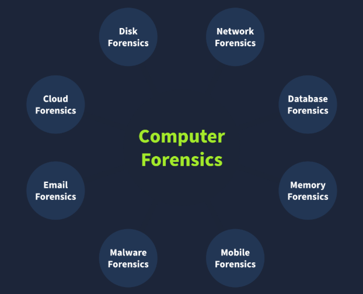

# Digital Forensics Fundamentals

## What this is
Forensics is the application of methods and procedures to investigate and solve crimes. For Cyber Crimes this is known as `Digital Forensics`. Cyber crime is any criminal activity conducted on or using a digital device.

## Digital Forensics Methodology
The National Institute of Standards and Technology `(NIST)` defines a general process for every case. The NIST works on defining frameworks for different areas of technology, including cyber security, where they introduce the process of digital forensics in four phases :

### Collection
Identifiying all the devices from which the data can be collected is essential (personal pc, laptops, digital cameras, usb, etc...). It is also necessary to ensure the original data is not tampered with while collecting the evidence and to maintain a proper document containing the collected intems details.

### Examination
The collected data may overwhelm investigators due to its size. This data usually needs to be filtered, and the data of interest needs to be extracted.

### Analysis
This is a critical phase. The investigators now have to analyze the data by correlating it wiht multiple pieces of evidence to draw conclusions.

### Reporting
In the last phase of digital forensics, a detailed report is prepared. This report contains the investigations methodology and detailed findings from the collected evidence. It may also contain recommendations.

### Types of Digital Forensics

## Evidence Acquisition
Evidence acquisition methods for digital devices depend on the type of digital device. However, some general practices must be followed while the evidence is acquired.

### Proper Authorization
The forensics team should obtain authorization from the relevant authorities before collecting any data `(warant)`.

### Chain of Custody
Imagine that a team of investigators collects all the evidence from the crime scene, and some of the evidence goes missing after a few days, or there is any change in the evidence. No individual can be held accountable in this scenario because there is no proper process for documenting the evidence owners. 

This problem can be solved by maintaining a chain of custody document. A chain of custody is a formal document containing all the details of the evidence. Some of the key details are listed below:

- Description of the evidence (name, type).
- Name of individuals who collected the evidence.
- Date and time of evidence collection.
- Storage location of each piece of evidence.
- Access times and the individual record who accessed the evidence.

### Use of Write Blockers
Write blockers are an essential part of the digital forensics team’s toolbox. Suppose you are collecting evidence from a suspect’s hard drive and attaching the hard drive to the forensic workstation. While the collection occurs, some background tasks in the forensic workstation may alter the timestamps of the files on the hard drive. This can cause hindrances during the analysis, ultimately producing incorrect results.

Suppose the data was collected from the hard drive using a write blocker instead in the same scenario. This time, the suspect’s hard drive would remain in its original state as the write blocker can block any evidence alteration actions.

## Window Forensics
Desktop computers and laptops are among the most common types of digital evidence collected from crime scenes because much criminal activity involves personal systems. These devices run different operating systems, and this overview focuses on `Windows`, a widely investigated OS in digital forensics.

### Forensic Imaging in Windows Investigations

During data collection, investigators create `forensic images`, which are `bit-by-bit copies` of system data. Two key categories are collected:

#### 1. Disk Image (Non-volatile)
A disk image contains all data stored on the system’s storage device (HDD, SSD, etc.).  
Because it is `non-volatile`, the data remains intact even after a shutdown or restart.

**Examples of disk artifacts:**
- Documents and media files  
- Browser history  
- System and application files  
- Other stored user data  

#### 2. Memory Image (Volatile)
A memory image captures data currently in the system’s `RAM`.  
This is `volatile`, meaning it will be lost if the system is powered off or restarted.

**Examples of memory artifacts:**
- Running processes  
- Open files  
- Current network connections  

**Priority note:**  
Memory should be captured **first** whenever possible to preserve volatile evidence before it disappears.

### Common Tools for Acquisition and Analysis

#### FTK Imager
A widely used tool for **disk imaging** on Windows.  
It provides a user-friendly GUI, supports multiple image formats, and can be used for:
- **Acquisition**
- **Basic disk image analysis**

#### Autopsy
An open-source digital forensics platform used for **in-depth disk image analysis**.  
It offers features such as:
- Keyword searching  
- Deleted file recovery  
- File metadata analysis  
- Extension mismatch detection  

###3 DumpIt
A command-line tool designed for **memory acquisition** on Windows.  
It can generate memory images in different formats.

#### Volatility
A powerful open-source framework for **memory analysis**.  
It uses specialized plugins to extract and analyze specific artifacts and supports:
- Windows  
- Linux  
- macOS  
- Android  

### Final Note
While FTK Imager, Autopsy, DumpIt, and Volatility are popular, **many other tools** are also used to acquire and analyze Windows disk and memory images.