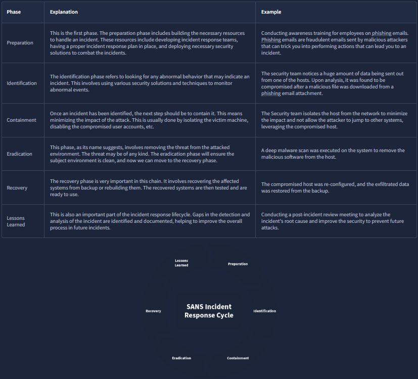
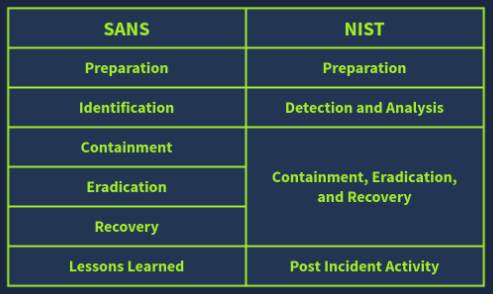

# Incident Response

## What this is
Incident Response handles an incident from its start to end. From deploying security in several areas to prevent incidents to fighting with them, and minimizing their impact, incident response is a thorough guideline.

### True and False Positives
 When a security solution finds an event or group of events associated with a possible harmful activity, it triggers an alert. The security team then analyzes these alerts. (True or False Positives).

- `True positive` :  A security solution raised an alert on a phishing attempt on one of the organization’s users. Upon analyzing this alert, the security team found that the email was a phishing email sent to this user to compromise the system.

- `False positive` : A security solution raised an alert on a high amount of data being transferred from one system to an external IP address. Upon analyzing this alert, the security team found that the subject system was undergoing a backup process to a cloud storage service, which caused this.

## Types of Incidents
- `Malware Infections` : A malicious program that can damage a system, network, or application. The majority of incidents are associated with malware infections.  There are different types of malware, each with a unique potential to cause damage. Malware infections are mostly caused by files that can be text, documents, executables, etc.

- `Security Breaches` : Security Breaches arise when an unauthorized person gets access to confidential data (something we don’t want them to see or have).  Security Breaches are of the utmost importance as many businesses rely on their confidential data, which must only be accessible to authorized personnel.

- `Data Leaks` : Incidents in which confidential information of an individual or an organization is exposed to unauthorized entities. Unlike Security Breaches, data leaks can also be unintentionally caused by human errors or misconfigurations.

- `Insider Attacks` : Incidents from within an organization are known as insider attacks. Think about a disgruntled employee infecting the whole network through a USB on his last day. This is an example of an insider attack. Someone within your organization intentionally initiating an attack comes under this category. These attacks can be hazardous, as an insider always has greater access to resources than an outsider.

- `Denial Of Service Attacks (DDoS)` : Denial of Service attacks, or DoS attacks, are incidents where the attacker floods a system/network/application with false requests, eventually making it unavailable to legitimate users. This happens due to the exhaustion of resources available to entertain the requests.

## Incident Response Process
Due to the distinct nature of incidents in organizations, there should be a structured process for incident response. Incident Response Frameworks help us in this regard. These are the generic approaches to follow in any incident for effective response. We will discuss the two widely used incident response frameworks: `SANS` and `NIST`.

### SANS - PICERL
The SANS incident Response framework has 6 phases, which can be called `PICERL` to remember them easily :

### NIST
The Incident Response Framework of NIST is similar to the SANS framework we studied above. The number of phases in this framework is reduced to 4.

### SANS vs NIST

## Incident Response Techniques
There are multiple security solutions that serve their own unique roles in detecting any incidents. Some of them even have the capability to respond to the incidents and execute the other phases of the lifecycle, such as containment, eradication, etc. A brief explanation of some of these solutions is given below:

- `SIEM` : Collects all important logs in one centralized location and correlates them to identify incidents.

- `AV` : Antivirus detects known malicous programs in a system and regularly scans your system for these.

- `EDR` : Endpoint Detection and Response is deployed on every system, protecting it against some advanced-level threats. This solution can also contain and eradicate the threat.

### Playbooks
Playbooks are the guidelines for a comprehensive incident reponse.

Here is an example of a Playbook for an incident: `Phishing Email`

1. Notify all the stakeholders of the phishing email incident.
2. Determine if the email was malicous by conductiing header and body analysis of the email.
3. Look for any attachments with the email and analyze them.
4. Determine if anybody opened the attachments.
5. Isolate the infected systems from the network.
6. Block the email sender.