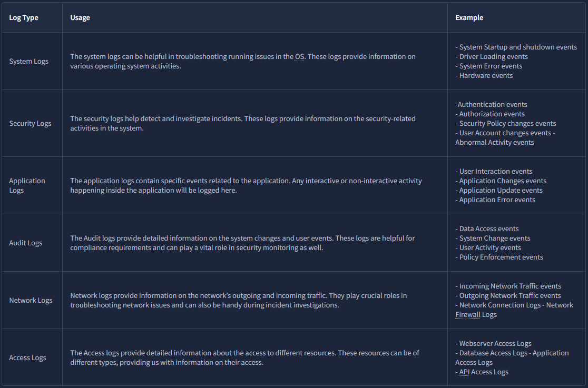
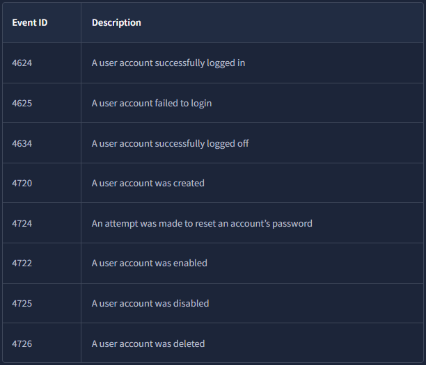

# Log Fundamentals

## What this is
Logs are the digital footprints left behind by any activity. The activity could be a normal one or the one with malicious intent. Tracing down the activity and the individual behind the execution of that activity becomes easier through logs.

There are various places inside a system where the traces of an attack could be fetched. The logs contain most of these traces. 

### Use Cases of Logs
- `Security Events Monitoring` : Logs help us detect anomalous behavior when real-time monitoring is used.

- `Incident Investigation and Forensics` : Logs are the traces of every kind of activity. It offers detailed information on what happened during the incident. The security team utilizes the logs to perform root cause analysis of incidents.

- `Troubleshooting` : As the logs also record the errors in systems or applications, they can be used to diagnose issues and helpful in fixing them.

- `Performance Monitoring` : Logs can also provide valuable insights into the performance of applications.

- `Auditing and Compliance` : Logs play a major role in Auditing and Compliance, making it easier with its capability to establish a trail of different kinds of activities.

## Types of Logs

## Windows Event Logs Analysis
Some of the crucial types of logs stored in a Windows Operating System are:
- `Application` : Any information related to applications is logged into this file. This information includes errors, warnings, compatibility issues, etc.

- `System` : Any information related to the OS operations is logged in the System log file. This information includes driver issues, hardware issues, system startup and shutdown information, services information, etc.

- `Security` : This is the most important log file in Windows OS in terms of security. It logs all security-related activities, including user authentication, changes in user accounts, security policy changes, etc.

### How Windows event log looks
When we open a specific log on `Event Viewer` we can see the following fields :
- `Description` : This field has a detailed information of the activity.
- `Log Name` : The Log Name indicates the log file name.
- `Logged` : This field indicates the time of the activity.
- `Event ID` : Event IDs are unique identifiers for a specific activity.

## Web Server Access Logs Analysis
We interact with many websites daily. Sometimes, we just want to view the website, and sometimes, we want to log in or upload a file into any available input field. These are just different kinds of requests we make to a website. All these requests are logged by the website and stored in a log file on the web server running that website.

This log file contains all the requests made to the website along with the information on the **timeframe**, the **IP requested**, the **request type**, and the **URL**. Following are the fields taken from a sample log from an Apache web server access log file which can be found in the directory: `/var/log/apache2/access.log` 

- `IP Addresss ` : “172.16.0.1” - The IP address of the user who made the request.
- `Timestamp` : “[06/Jun/2024:13:58:44]” - The time when the request was made to the website.
- `Request` : The request details.
    - **HTTP Method** : “GET” - Tells the website what action to be performed on the request.
    - **URL** : “/” - The requested resource.
- `Status Code` : “200” - The response from the server. Different numbers indicate different response results
- `User-Agent` : “Mozilla/5.0 (Macintosh; Intel Mac OS X 10_12_3) AppleWebKit/537.36 (KHTML, like Gecko) Chrome/58.0.3029.110 Safari/537.36” - Information about the user’s Operating System, browser, etc. when making the request.