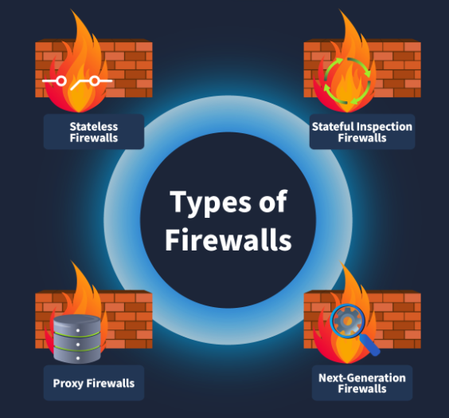

# Firewall Fundamentals

## What this is
A firewall inspects incoming and outgoing network traffic and allows or blocks it according to rules. Modern firewalls often add features like application awareness, threat feeds, and deep packet inspection (DPI).

## Types of Firewalls

### Stateless Firewall
Inspects each packet independently (OSI layers 3–4). Fast and low-overhead; no connection tracking.

### Stateful Firewall
Tracks active connections and allows related return traffic (OSI layers 3–4). Common choice for general network protection.

### Proxy Firewall (App-Level)
Operates at the application layer (OSI 7), inspecting and forwarding requests for protocol-aware filtering and content control.

### Next-Generation Firewall (NGFW)
Combines traditional filtering with DPI, IPS, app awareness, and threat-intel integration (OSI 3–7). Provides advanced protection at higher resource cost.

### Comparison Summary
| Firewall Type | OSI Layers | State Tracking | Deep Packet Inspection | Typical Use Case | Performance |
|---|---:|:---:|:---:|---|---:|
| Stateless | 3–4 | No | No | High-speed packet filtering | Very high (low overhead) |
| Stateful | 3–4 | Yes | Limited (header-based) | General network perimeter | High |
| Proxy (App-level) | 7 | Yes (per-connection) | Yes (application payload) | Web filtering, protocol controls | Moderate |
| NGFW | 3–7 | Yes | Yes (DPI, SSL/TLS) | Enterprise threat prevention | Moderate (resource intensive)

### Choosing the Right Firewall
- Stateless: minimal latency and simple rules.
- Stateful: default choice for most networks.
- Proxy: when application-level filtering or anonymization is needed.
- NGFW: when integrated threat prevention and visibility are required.

The concise descriptions above should be easier to scan; tell me if you want these shortened further or converted into a quick checklist.

## Rules
A firewall enforces traffic control using rules. Each rule is a small, structured statement describing which traffic to match and what to do with it.

### Basic components (one-line):
- **Source address:** origin IP or network.
- **Destination address:** target IP or network.
- **Port:** destination (or source) port number.
- **Protocol:** e.g., TCP, UDP, ICMP.
- **Action:** what to do (Allow, Deny, Forward).
- **Direction:** Inbound, Outbound, or Forwarding.

### Types of actions :
- **Allow:** permit matching traffic.
- **Deny:** block matching traffic.
- **Forward:** redirect matching traffic to another host/segment.

### Examples (compact):

| Action | Source | Destination | Protocol | Port | Direction |
|---|---|---|---:|---:|---|
| Allow | `192.168.1.0/24` | Any | TCP | 80 | Outbound |
| Deny | Any | `192.168.1.0/24` | TCP | 22 | Inbound |
| Forward | Any | `192.168.1.8` | TCP | 80 | Inbound |

### Rule directionality (short):
- **Inbound:** apply to traffic entering your network (e.g., public → web server).
- **Outbound:** apply to traffic leaving your network (e.g., clients → Internet).
- **Forwarding:** used by gateway/firewall to route traffic to internal hosts or other segments.

### Tips (single line each):
- Order matters: many firewalls evaluate rules top-to-bottom; place specific rules before general ones.
- Least privilege: default deny and allow only required traffic.
- Use logging: log matched rules for auditing and tuning.

