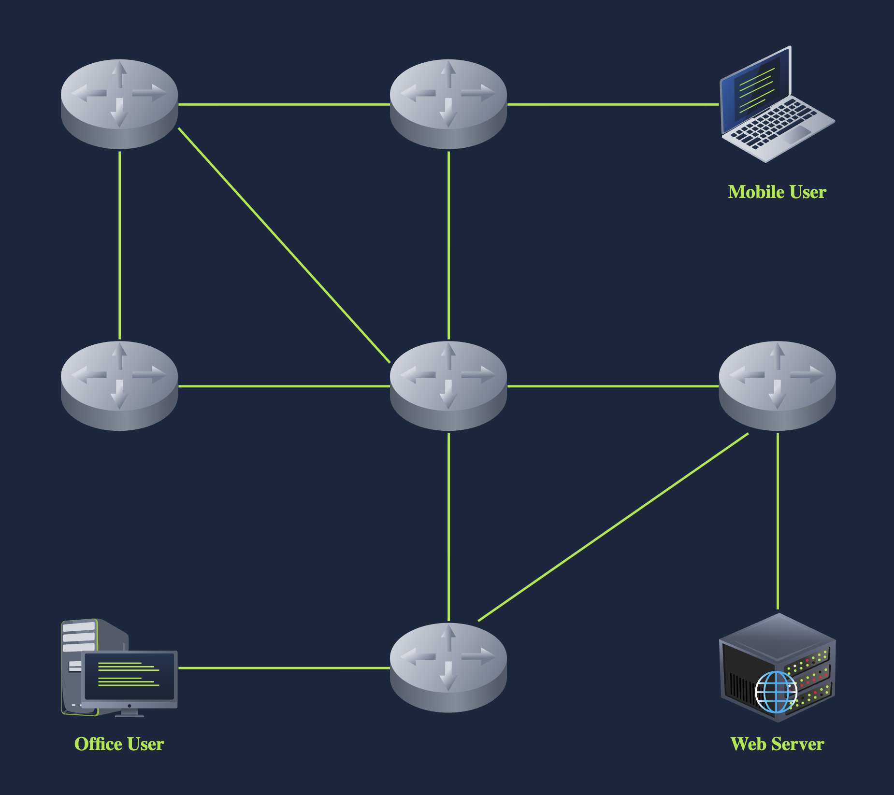
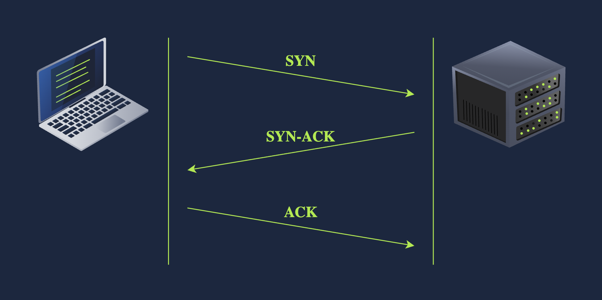
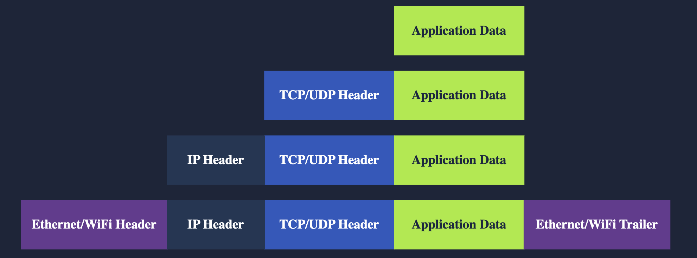

# Networking Concepts

## What this is
This room covers fundamental networking concepts, including the OSI and TCP/IP models, IP addresses, subnets, routing, TCP/UDP protocols, encapsulation, and practical tools like Telnet. It's part of the TryHackMe Networking series.

## OSI Model
The OSI (Open Systems Interconnection) model is a 7-layer framework for network communications.

### Layers Overview

| Layer | Name | Function | Examples |
|-------|------|----------|----------|
| 7 | Application | Services and interfaces to applications | HTTP, FTP, DNS, POP3, SMTP, IMAP |
| 6 | Presentation | Data encoding, encryption, compression | Unicode, MIME, JPEG, PNG, MPEG |
| 5 | Session | Establishing/maintaining/synchronizing sessions | NFS, RPC |
| 4 | Transport | End-to-end communication and segmentation | UDP, TCP |
| 3 | Network | Logical addressing and routing | IP, ICMP, IPSec |
| 2 | Data Link | Reliable data transfer between adjacent nodes | Ethernet (802.3), WiFi (802.11) |
| 1 | Physical | Physical data transmission media | Electrical, optical, wireless signals |

### Key Points
- **Mnemonic**: "Please Do Not Throw Spinach Pizza Away"
- Layer 1: Physical connections and signals.
- Layer 2: MAC addresses for local network communication.
- Layer 3: IP addresses and routing between networks.
- Layer 4: TCP/UDP for host-to-host communication.
- Layers 5-7: Application-specific protocols and data handling.

## TCP/IP Model
TCP/IP is a 4-layer model used in practice, mapping to OSI layers.

### Layers Mapping
| OSI Layer | TCP/IP Layer | Examples |
|-----------|--------------|----------|
| 7 | Application | HTTP, HTTPS, FTP, POP3, SMTP, IMAP, Telnet, SSH |
| 6 | Presentation | - |
| 5 | Session | - |
| 4 | Transport | TCP, UDP |
| 3 | Internet | IP, ICMP, IPSec |
| 2 | Link | Ethernet 802.3, WiFi 802.11 |
| 1 | Physical | - |

### Key Points
- Designed for resilience.
- Application layer combines OSI 5-7.
- Internet layer = OSI 3.
- Transport = OSI 4.
- Link = OSI 2.

## IP Addresses and Subnets
IP addresses identify hosts on networks. Focus on IPv4.

### Structure
- 32 bits, 4 octets (0-255 each).
- Example: 192.168.0.1
- Subnet mask: e.g., 255.255.255.0 (/24)
- Network: First address in range.
- Broadcast: Last address in range.

### Private IP Ranges
- 10.0.0.0/8
- 172.16.0.0/12
- 192.168.0.0/16

### Routing
Routers forward packets based on destination IP.

## UDP and TCP
Transport layer protocols using ports (1-65535).

### UDP
- Connectionless, no guarantee.
- Faster, like sending mail without tracking.

### TCP
- Connection-oriented, reliable.
- Uses three-way handshake: SYN → SYN-ACK → ACK.

## Encapsulation
Data is encapsulated with headers at each layer.
- Application data → TCP/UDP segment/datagram → IP packet → Data link frame.

### Life of a Packet
1. User request → HTTP.
2. TCP handshake.
3. IP packet with source/dest IPs.
4. Frame sent via link layer.
5. Routers forward to destination.

## Telnet
Protocol for remote terminal access. Use `telnet IP PORT` to connect.

### Common Ports
- 7: Echo
- 13: Daytime
- 80: HTTP

### Commands
- Connect: `telnet MACHINE_IP PORT`
- Send HTTP: `GET / HTTP/1.1` followed by `Host: domain` and blank line.
- Exit: Ctrl + ]

## Conclusion
This covers the basics of networking. Memorize models, protocols, and practice with tools.